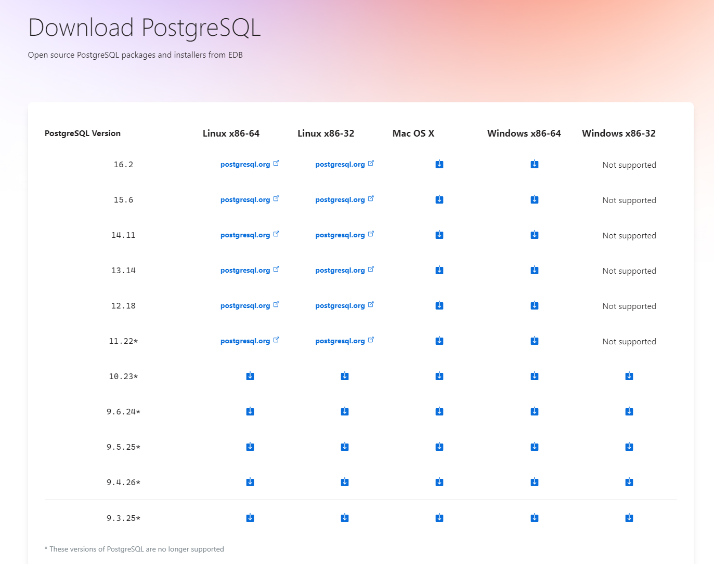
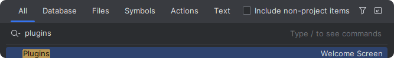
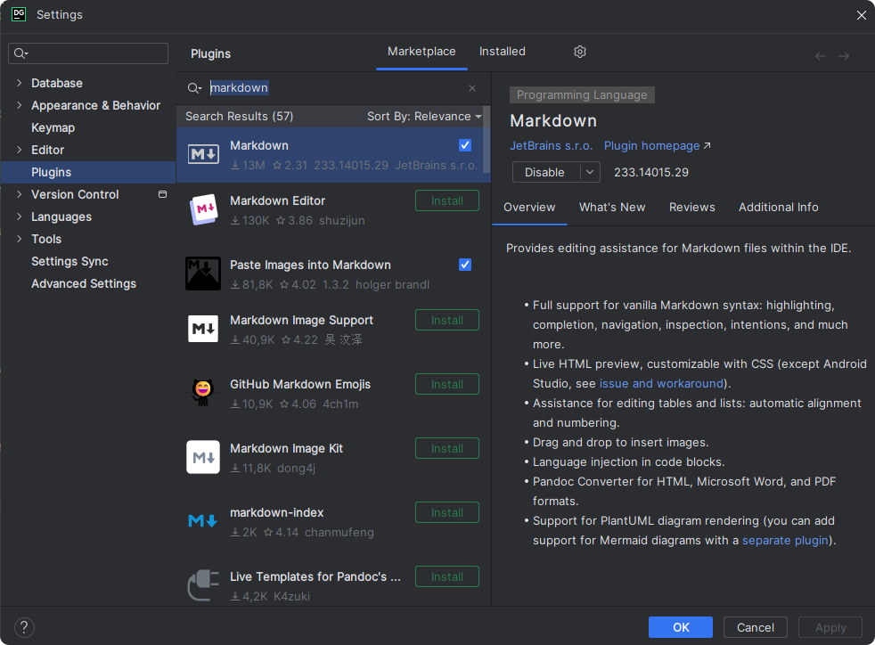
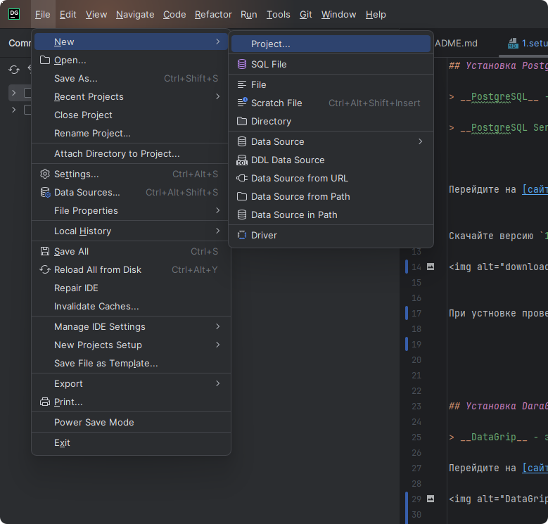
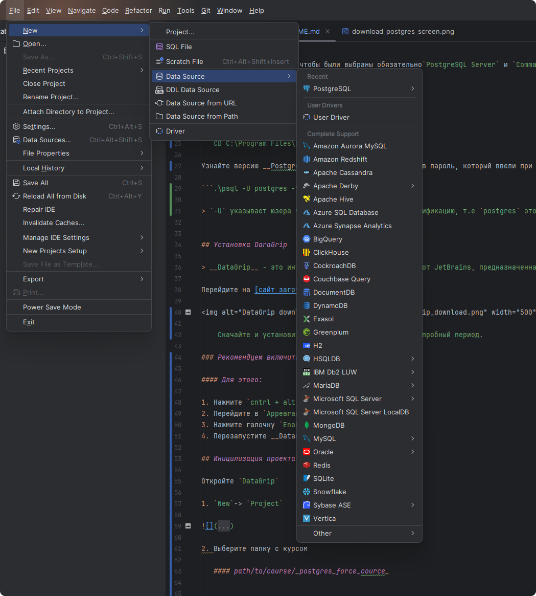
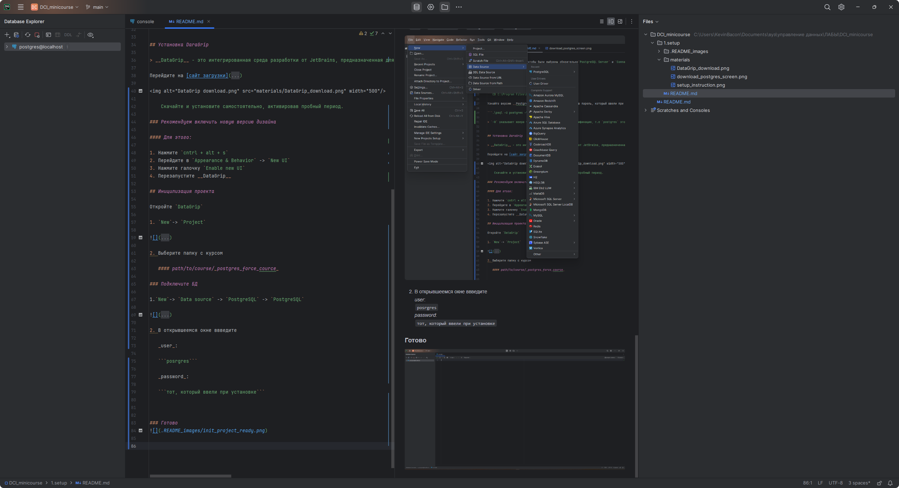

## Установка Postgres SQL

> __PostgreSQL__ - это мощная и бесплатная объектно-реляционная система управления базами данных (СУБД), используемая такими компаниями, как _Instagram_, _Uber_, _Netflix_, _GitHub_

> __PostgreSQL Server__ - сервер для работы с __PostgreSQL__, к которому можно подключиться удаленно и через спицальную
> консоль отправлять SQL запросы.


Перейдите на [сайт загрузки](https://www.enterprisedb.com/downloads/postgres-postgresql-downloads) 


Скачайте версию `16.2`




При устновке проверьте, чтобы были выбраны обязательно`PostgreSQL Server` и `Command Line Tools`

### Проверка работы PostgreSQL

Откройте PowerShell
Перейдите в каталог bin выполнив команду:

```CD C:\Program Files\PostgreSQL\<version>\bin```

Узнайте версию __PostgreSQL__ выполнив команду и указав пароль, который ввели при установке:

```.\psql -U postgres -V```

> `-U` указывает юзера через которого надо пройти аунтификацию, т.е `postgres` это имя пользователя


## Установка DaraGrip

> __DataGrip__ - это интегрированная среда разработки от JetBrains, предназначенная для работы с различными системами управления базами данных, включая _PostgreSQL_ и другие. В нем есть специальный SQL редактор и комфортная визуалиция вывода данных.

Перейдите на [сайт загрузки](https://www.enterprisedb.com/downloads/postgres-postgresql-downloads)


    Скачайте и установите самостоятельно, активировав пробный период.

### Рекомендуем включить новую версию дизайна

#### Для этого:

1. Нажмите `cntrl + alt + s`
2. Перейдите в `Appearance & Behavior` -> `New UI`
3. Нажмите галочку `Enable new UI`
4. Перезапустите __DataGrip__

### Установка MarkDown для просмотра заданий внутри __DataGrip__

1. Нажмите два раа `shift`
2. Введите в поиске _plugins_

   
3. Нажмите `enter`

4. Введите в поиске _Markdown_

   

5. Установите и перезапустите приложение

## Иницилизация проекта

Откройте `DataGrip`

1. `New`-> `Project`



2. Выберите папку с курсом

   #### path/to/course/_postgres_force_cource_

### Подключите БД

1.`New`-> `Data source` -> `PostgreSQL` -> `PostgreSQL`



2. В открывшеемся окне ввведите

   _user_:

   ```posrgres```

   _password_:

   ```тот, который ввели при установке```

### Готово



> - Просматривайте текст заданий и файлы проекта прямо внутри _DataGrip_
> -> __Для этого нажмите `alt+2`__


> - Просматривайте базы данных, таблицы, и сами даннные прямо внутри _DataGrip_
> -> __Для этого нажмите `alt+1`__


