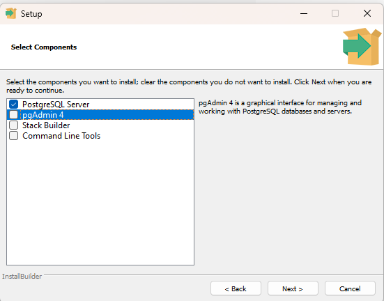

## Установка Postgres SQL

> __PostgreSQL__ - это мощная и бесплатная объектно-реляционная система управления базами данных (СУБД), используемая такими компаниями, как _Instagram_, _Uber_, _Netflix_, _GitHub_

> __PostgreSQL Server__ - сервер для работы с __PostgreSQL, к которому можно подключиться удаленно и через спицальную консоль отправлять SQL запросы. 

Перейдите на [сайт загрузки](https://www.enterprisedb.com/downloads/postgres-postgresql-downloads) 

Скачайте версию `16.2`

При устновке выберите только `PostgreSQL Server`

## Установка DaraGrip

> __DataGrip__ - это интегрированная среда разработки от JetBrains, предназначенная для работы с различными системами управления базами данных, включая _PostgreSQL_ и другие. В нем есть специальный SQL редактор и комфортная визуалиция вывода данных.

Перейдите на [сайт загрузки](https://www.enterprisedb.com/downloads/postgres-postgresql-downloads)

`Скачайте и установите самостоятельно, активировав пробный период.`K