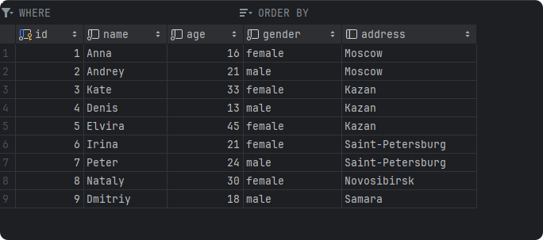

# Создание первой таблицы

[Задание 1](#Задание1)

[Задание 2](#Задание2)

## SQL CREATE TABLE

Пример создания таблицы

```sql
CREATE TABLE person
(
    id      BIGINT PRIMARY KEY,
    name    VARCHAR NOT NULL,
    age     INTEGER NOT NULL DEFAULT 10,
    gender  VARCHAR          DEFAULT 'female' NOT NULL,
    address VARCHAR
);
```

Разберем синтаксис:

- `CREATE TABLE` - ключевое слово для создания новой таблицы в базе данных.

- `person` - название таблицы, которую вы хотите создать.

- `( id BIGINT PRIMARY KEY, ...)` -
  определение структуры таблицы. Здесь определяются поля таблицы `(id, name...)`, их типы `(BIGINT, VARCHAR..)` и
  ограничения (например, `NOT NULL` и значения по умолчанию `Deafualt`).
    - `PRIMARY KEY` - определяет первичный ключ таблицы, обеспечивающий уникальность значений в столбце `id`.

Кстати  `PRIMARY KEY`, как и `NOT NULL`  - это __ограничения столбцов__

> Ограничения (constraints) в базах данных используются для задания правил целостности данных, чтобы гарантировать их
> корректность. Вот несколько основных типов ограничений `UNIQE`, `FOREIGN KEY`, `CHECK`, `PRIMARY KEY`, `FOREIGN KEY`


Вот пример использования одного из них

```sql
ALTER TABLE table_name
    ADD CONSTRAINT constraint_name CHECK (column == 'bebra' OR column == 'nuhal');
```

## SQL INSERT INTO

Оператор INSERT INTO используется для вставки новых записей в таблицу.

1) Вы можете указывать кокретные столбцы, для которых собираетесь вставить данные

```sql
INSERT INTO table_name (column1, column2, column3, ...)
VALUES (value1, value2, value3, ...);
```

2) Или не перечислять столбцы, если собираетесь указать данные для всей строки

```sql
INSERT INTO table_name
VALUES (value1, value2, value3, ...);
```

3) Оператор INSERT INTO SELECT используется для вставки новых записей в таблицу из другой таблицы

```sql
INSERT INTO table2
SELECT *
FROM table1
WHERE condition;
```

4) Можно выбирать конкретные поля c помощью вложеннго запроса, а также изменить их, например прибавить 1

```sql
INSERT INTO table2 (column1, column2, column3, ...)
SELECT column1 + 1,
       column2,
       column3,
FROM table1
WHERE condition;

```

5) Можно выбирать отдельно данные с помощью влоеженных запросов.
   __Главное чтобы запрос возвращал одно значение, если это не так, то можно добавить _LIMIT___

```sql
INSERT INTO table1 (column1, column2, column3, ...)
VALUES ((SELECT MAX(column1) FROM table1),
        (SELECT column2 FROM table3 LIMIT 1),
        (SELECT column3 FROM table4 LIMIT 1)) WHERE condition;

```

## Задание1

1. Откройте файл [1.sql](1.sql)

2. Проанализируйте запросы
3. Добавьте ограничение CHECK на пол person, чтобы он был `male` или `female`
4. Создайте таблцицу _pizzeria_ в указанном блоке со следующими полями

   | Column |    Type   | Not Null | Default |
                                                                                                                                                                                     |--------|:---------:|:--------:|:-------:|
   | id     |  bigint   |    ✔️    |         |
   | name   |  varchar  |    ✔️    |         |
   | rating | numeric   |    ✔️    |    0    |
5. Попробуйте запустить только запрос на создание таблицы _person_

    - Для этого кликните курсором в области нужного запроса и нажимайте  `cntrl+w`, пока нужный запрос не выделиться
      полностью и нажмите `cntrl+enter`

   

6. Проверьте создалась ли таблица, нажав `alt+1`, найдя среди информации столбцы таблицы

   
   

7. Запустите все запросы из файла [1.sql](1.sql) и также проверьте коректность выполнения

## Задание2

1. Проанализируйте запросы в [2.sql](2.sql)
2. Добавьте новую пиццерию с помощью запроса, подсчитва новый id с помощью _INSERT INTO SELECT_
    - _подсказка_ используйте агрегатную функцию max
   ```sql
   SELECT max(id_column)
   FROM table1
   ```
3. Добавьте пиццерию с помощью обычного _INSERT INTO_
    - посмотрите какой id должен быть через
      __Database Explorer__ `alt + 2`

4. Добавьте новую пиццу _'kai pizza'_ в меню у пиццерии _DoDo Pizzeria'и_ за 700, сделайте запрос похожий как в 5-ом
   пунтке про
   _INSERT_.
   - Новое id записи в меню и id пиццерии подсчитывается с помощью вложенных запросов
   - Запрос запишите [3.sql](3.sql)

7. Запустите все запросы

